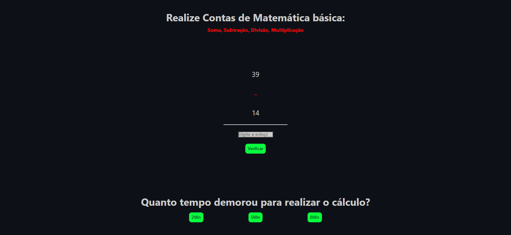

# Project Math-Calculation

This repository was created for a project based on the Odin Project calculator. However, I reformulated the idea to develop a project that uses basic mathematical operations to challenge the user.

📧 Send me an email: henrykaua21@gmail.com 

🔗 Connect with me on [LinkedIn](https://www.linkedin.com/in/henry-kaua/)

🐛 Open an [issue](https://github.com/henrymzs/math-calculations/issues) in the repository 

Any help is greatly appreciated and contributes to my growth as a developer. 🚀

Result:

